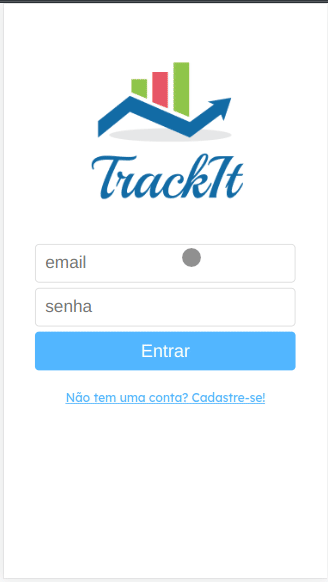

# TrackIt: App Monitorador de Hábitos


<h2>Sobre:</h2>

<div text-align="center" align="left">
<p>Trata-se de um aplicativo web cuja finalidade primordial é o monitoramento de hábitos semanais, no qual há a possibilidade de criar novos hábitos a serem seguidos, marcá-los como realizados, e, então, ter a possibilidade de checar o progresso de cada um deles. </p>
</div>

<div align="left">
<h2>Principais Funcionalidades:</h2>

<ul align="left">
 <li align="left">👤 Criação de Usuário + Login/Logout</li>
 <li align="left">📅 Criação de <strong>Hábitos</strong> conforme os dias da semana</li>
 <li align="left">📈 Acompanhamento do progresso dos hábitos na página "Hoje"</li>
 <li align="left">✅ Marcar hábito como concluído no dia</li>
 <li align="left">❌ Deleção de um hábito</li>
</ul>

</div>

<div align="left">
<h2>Link para Demo:</h2>
Clique aqui para acessar => <a href="projeto11-trackit-two-alpha.vercel.app">TrackIt</a>
</div>

<div align="left">
<h2>Como foi feito:</h2>
<p>Foi desenvolvido em ReactJS, utilizando, principalmente, das bibliotecas React Router Dom e Styled Components, e consumindo e gravando dados de uma API externa. </p>
<h4>Stack de Tecnologias Utilizadas:</h4>


<h4>Por que foi feito?</h4>
<p>Foi um projeto da minha formação de desenvolvimento web full-stack, no qual tínhamos que demonstrar os nossos recentes aprendizados com requisições com Axios, envio de formulários para APIs, autenticação com uso de tokens, ContextAPI, hook useEffect, biblioteca React Router Dom e a sua relação com as Single Page Applications. </p>
</div>

## Como executar para desenvolvimento no Seu Computador
1. Instale as dependências:
```bash
npm i
```
2. Execute-o:
```bash
npm start
```
3. Ou, opcionalmente, você pode buildá-lo:
```bash
npm run build
```
4. E, então, acessar http://localhost:3000
